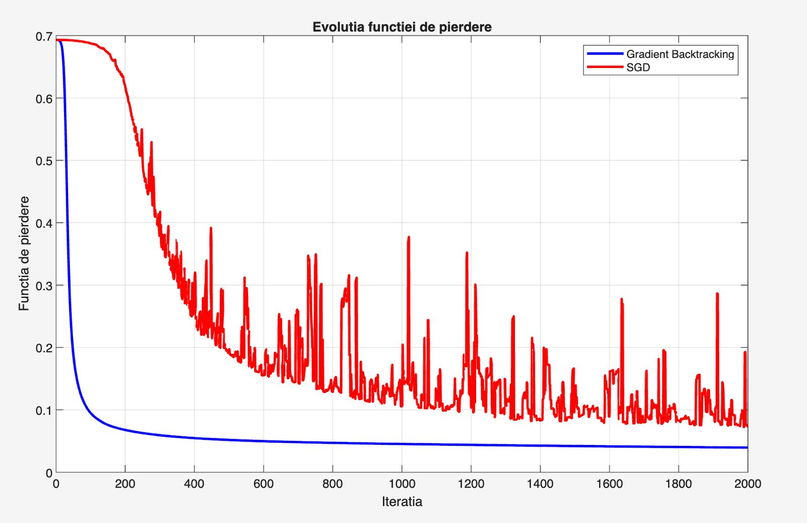
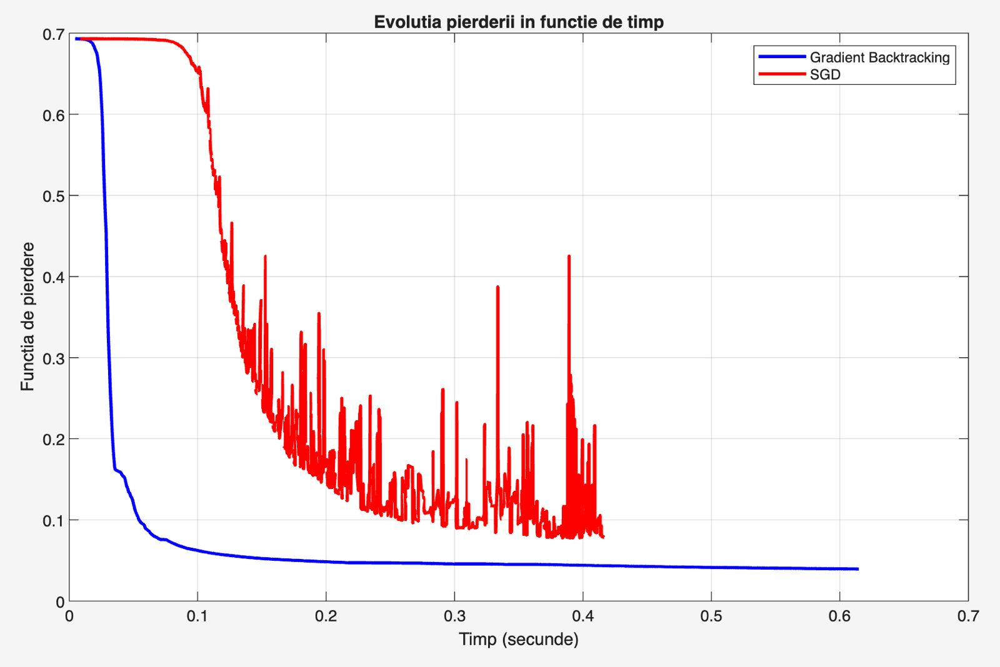
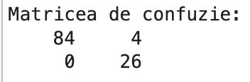

# 🧠 Breast Cancer Neural Network Classifier

> [!IMPORTANT]
> **Core Problem Solving:** Given 30 numerical measurements extracted from breast tumor cell images, predict whether a tumor is **malignant (class 1)** or **benign (class 0)**. This project implements a shallow neural network trained from scratch using two unconstrained optimization algorithms — **Gradient Descent with Backtracking** and **Stochastic Gradient Descent (SGD)** — and benchmarks their convergence behavior and classification performance on the [WDBC dataset](https://archive.ics.uci.edu/ml/datasets/Breast+Cancer+Wisconsin+(Diagnostic)).

---

## 📐 Mathematical Formulation

### 1. Loss Function — Binary Cross-Entropy

The chosen loss function is binary cross-entropy, which strongly penalizes confident wrong predictions:

$$L(\mathbf{e}, \hat{\mathbf{y}}) = -\frac{1}{N} \sum_{i=1}^{N} \left[ e_i \log(\hat{y}_i) + (1 - e_i) \log(1 - \hat{y}_i) \right]$$

where $\mathbf{e} \in \{0, 1\}^N$ is the ground-truth label vector and $\hat{\mathbf{y}} \in (0, 1)^N$ is the prediction vector.

### 2. Neural Network Architecture

A shallow network with $m = 15$ hidden neurons and **SoftSign** as the activation function (function #43):

$$g(z) = \frac{z}{1 + |z|}, \qquad g'(z) = \frac{1}{(1 + |z|)^2}$$

The full prediction pipeline is:

$$\hat{\mathbf{y}} = \sigma\!\left( g(\bar{A} X)\, \mathbf{x} \right)$$

where $X \in \mathbb{R}^{31 \times 15}$ are the hidden layer weights, $\mathbf{x} \in \mathbb{R}^{15}$ are the output layer weights, and $\bar{A} \in \mathbb{R}^{N \times 31}$ is the augmented input matrix (30 features + bias column).

### 3. Gradient of the Loss

Let $Z = \bar{A}X$, $H = g(Z)$, $\boldsymbol{\delta} = \hat{\mathbf{y}} - \mathbf{e}$. The gradients with respect to both parameter sets are:

$$\frac{\partial L}{\partial \mathbf{x}} = \frac{1}{N} H^{\top} \boldsymbol{\delta}$$

$$\frac{\partial L}{\partial X} = \frac{1}{N} \bar{A}^{\top} \left( \boldsymbol{\delta}\, \mathbf{x}^{\top} \odot g'(Z) \right)$$

where $\odot$ denotes element-wise multiplication.

---

## 📊 Dataset & Preprocessing

**Wisconsin Diagnostic Breast Cancer (WDBC)** — 569 samples, 30 numerical features computed from 10 cell nucleus properties (radius, texture, perimeter, area, smoothness, compactness, concavity, concave points, symmetry, fractal dimension), each measured as mean, standard error, and worst value.

### Data Split & Normalization

| Split | Samples | Malignant | Benign |
| :--- | :---: | :---: | :---: |
| Training (80%) | 455 | 186 | 269 |
| Testing (20%) | 114 | 26 | 88 |

**Min-Max Normalization** is applied exclusively on training statistics and then used to transform the test set — simulating a real-world deployment scenario where test data is unseen:

$$a_{\text{norm}} = \frac{a - a_{\min}}{a_{\max} - a_{\min}}$$

A bias column of ones is appended to yield $\bar{A} \in \mathbb{R}^{N \times 31}$.

---

## 🚀 Optimization Algorithms

### 🔹 1. Gradient Descent with Backtracking Line Search (`script.m`)

At each iteration, a step size $\alpha_k$ is found that satisfies the **Armijo condition**:

$$f\!\left(\mathbf{w}_k - \alpha_k \nabla f(\mathbf{w}_k)\right) \leq f(\mathbf{w}_k) - c_1 \cdot \alpha_k \cdot \lVert \nabla f(\mathbf{w}_k) \rVert^2$$

If the condition fails, the step is halved: $\alpha \leftarrow \rho \cdot \alpha$. This guarantees a monotone decrease in the objective at every step.

**Parameters:** $\alpha_{\text{init}} = 1$, $\rho = 0.5$, $c_1 = 10^{-4}$, $\varepsilon = 10^{-4}$, `maxIter` $= 2000$

**Advantage:** Fully automatic step adaptation — no manual tuning. Monotone convergence guaranteed.

**Disadvantage:** Multiple loss evaluations per iteration (inside the backtracking loop) increase per-step computational cost.

### 🔹 2. Stochastic Gradient Descent (`script.m`)

Instead of computing the full-batch gradient over all $N$ examples, SGD estimates it using a **single randomly selected sample** $\xi_k$ at each step:

$$\mathbf{w}_{k+1} = \mathbf{w}_k - \alpha \nabla f(\mathbf{w}_k, \xi_k)$$

**Parameters:** $\alpha = 0.1$ (fixed), $\varepsilon = 10^{-4}$, `maxIter` $= 2000$

**Advantage:** Each iteration is $N$ times cheaper than full-batch gradient descent.

**Disadvantage:** With a fixed step size, SGD does not converge to $\lVert \nabla f \rVert = 0$ — it oscillates around the minimum, producing noisy loss curves.

---

## 📈 Results

### Loss Evolution

| Loss vs. Iterations | Loss vs. Wall-Clock Time |
|---|---|
|  |  |

Backtracking delivers a **monotone, stable decrease** from $0.69$ to $0.0399$. SGD also decreases but with large oscillations characteristic of stochastic methods, reaching a final loss of $0.0798$. From a time perspective, SGD is faster (0.11s vs 0.20s) since each iteration processes only one sample — but Backtracking achieves a lower final loss.

> [!NOTE]
> The initial loss of $\approx \ln(2) \approx 0.693$ confirms the network starts from a near-random 50/50 prediction — exactly as expected with small random initialization.

### Classification Performance

| Metric | 🔵 Backtracking | 🔴 SGD |
| :--- | :---: | :---: |
| **Accuracy** | **96.49%** | 93.86% |
| **Precision** | **86.67%** | 78.79% |
| **Sensitivity (Recall)** | **100.00%** | **100.00%** |
| **Specificity** | **95.45%** | 92.05% |
| **F1-Score** | **92.86%** | 88.14% |
| Execution Time | 0.20s | 0.11s |

**Confusion Matrix — Backtracking:**



> [!IMPORTANT]
> **Both methods achieve 100% Sensitivity** — zero malignant tumors were misclassified as benign. This is the most critical metric in a medical context: a false negative (missed malignancy) is far more dangerous than a false positive.

---

## 🗂️ Repository Structure

```
Breast-Cancer-NN-Classifier/
│
├── script.m                  # Main script: data loading, training, evaluation, plots
├── functie_pierdere.m        # Loss function + gradient computation
├── softsign.m                # SoftSign activation function
├── softsign_derivata.m       # SoftSign derivative
├── sigmoid.m                 # Sigmoid output activation
│
├── wdbc.data                 # Raw WDBC dataset (UCI)
├── wdbc.names                # Feature descriptions
│
└── assets/
    ├── confusion_matrix.png  # Confusion matrix — Backtracking
    ├── loss_evolution.png    # Loss vs. iterations comparison
    └── loss_vs_time.png      # Loss vs. wall-clock time comparison
```

---

## ▶️ How to Run

1. Clone the repository and open MATLAB.
2. Make sure all `.m` files and `wdbc.data` are in the same directory.
3. Run `script.m` — it will:
   - Load and preprocess the WDBC dataset
   - Train the network using both Backtracking and SGD
   - Print performance metrics to the console
   - Generate all comparison plots automatically

```matlab
>> script
```

---

## 🔑 Key Takeaways

- **Backtracking is the better method** for this dataset size: higher accuracy (96.49% vs 93.86%), lower final loss, and stable reproducible results — at the cost of slightly more wall-clock time (0.20s vs 0.11s).
- **SGD is faster per-iteration** and is preferred for large-scale datasets where a full gradient pass is prohibitively expensive.
- **SoftSign** is a smooth, bounded activation that avoids the vanishing gradient problem of tanh while remaining differentiable everywhere — a strong choice for shallow networks.
